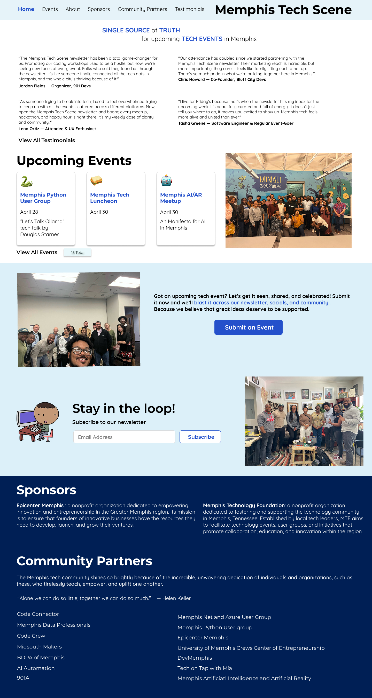

# Memphis Tech Scene Newsletter

**Memphis Tech Scene** is your go-to newsletter spotlighting the people, projects, and events driving Memphis' growing tech ecosystem. Each edition highlights upcoming meetups and ways to get involved. Our mission is to increase awareness, strengthen community connections, and support the growth of a vibrant and inclusive tech scene in Memphis.

[Click to view: S & F Maintenance Assistant](https://sfmaintenance.netlify.app/)

## Features
1. Provide a menu of potential maintenance tasks that are selected via checkboxes.
2. Logs completed actions.
3. Provides a platform for documenting any issues discovered at the car wash.

## Built with
- **Next.js** is a frontend JavaScript framework, based on React but with server components/actions, used for displaying the user interface. 
- **TailwindCSS** is a CSS library utilized to quickly style the application. 
- **Jest** serves as a component testing framework. 
- **Netlify** is the hosting platform employed for hosting the application.
- **lucide-react** is a React Icon web library.

## Get Started
1. Clone the repo
2. In the terminal for the carwash directory, type "npm install" to install the libraries.
3. Because the repo dosen't come with the needed environment variables, you will need to enable the API to make an fake call to get dummy data and NOT call the production database. 
4. In the terminal, type "npm run dev"

## Author
- Website - [JC Smiley](https://www.jcsmileyjr.com)
- Twitter - [@JCSmiley4](https://twitter.com/JCSmiley4)
- LinkedIn - [jcsmileyjr](https://www.linkedin.com/in/jcsmileyjr/)